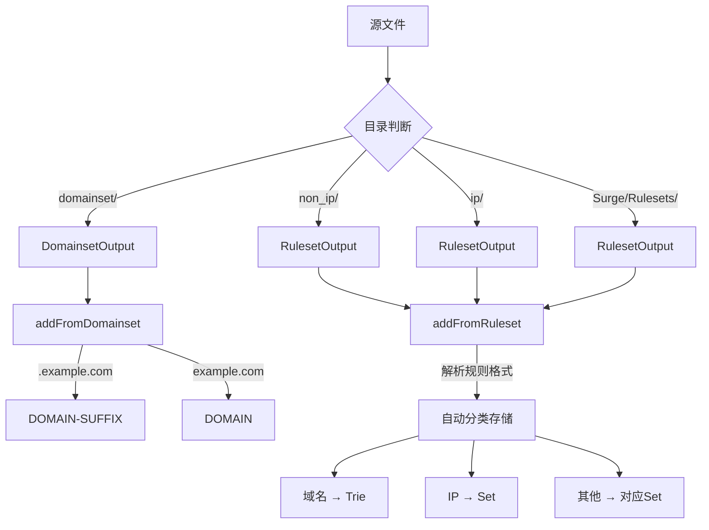

# 规则类型自动判断和处理机制

## ✅ 是的，系统具备了自动根据规则文件的格式判断规则集类型并相应处理的能力

### 1. 规则类型判断机制

系统使用**基于目录结构**的判断方式：

```typescript
// build-common.ts
switch (file.type) {
  case 'domainset':
    output = new DomainsetOutput(span, file.id);
    await output.addFromDomainset(content);
    break;

  case 'non_ip':
    output = new RulesetOutput(span, file.id, 'non_ip');
    await output.addFromRuleset(content);
    break;

  case 'ip':
    output = new RulesetOutput(span, file.id, 'ip');
    await output.addFromRuleset(content);
    break;
}
```

### 2. Domainset 规则集处理

**文件位置**: `Source/domainset/` 目录  
**处理方法**: `addFromDomainset()` (base.ts:163-182 行)

✅ **自动转换 .example.com 为 example.com**：

```typescript
private async addFromDomainsetPromise(source) {
  for await (const line of await source) {
    if (line[0] === '.') {
      // .example.com → example.com (DOMAIN-SUFFIX)
      this.addDomainSuffix(line.substring(1));
    } else {
      // example.com → DOMAIN
      this.domainTrie.add(line, false);
    }
  }
}
```

**支持的格式**：

- `example.com` → 转换为 `DOMAIN,example.com`
- `.example.com` → 转换为 `DOMAIN-SUFFIX,example.com`

### 3. Ruleset 规则集处理

**文件位置**:

- `Source/non_ip/` - 混合规则（域名+其他）
- `Source/ip/` - IP 规则
- `Surge/Rulesets/` - 混合规则集

**处理方法**: `addFromRuleset()` (base.ts:184-242 行)

✅ **自动提取域名部分**：

```typescript
private async addFromRulesetPromise(source) {
  for await (const line of await source) {
    const splitted = line.split(',');
    const type = splitted[0];
    const value = splitted[1];

    switch (type) {
      case 'DOMAIN':
        this.domainTrie.add(value, false);
        break;
      case 'DOMAIN-SUFFIX':
        this.addDomainSuffix(value);
        break;
      case 'DOMAIN-KEYWORD':
        this.addDomainKeyword(value);
        break;
      // ... 其他规则类型
    }
  }
}
```

**支持的规则格式**：

- `DOMAIN,example.com` → 提取 `example.com`
- `DOMAIN-SUFFIX,example.com` → 提取 `example.com`
- `DOMAIN-KEYWORD,example` → 提取 `example`
- `DOMAIN-WILDCARD,*.example.com` → 提取 `*.example.com`
- `IP-CIDR,1.1.1.0/24` → 存储到 IP 规则集
- `USER-AGENT,*WeChat*` → 存储到 User-Agent 规则集
- 等等...

### 4. 处理流程总结



### 5. 自动优化功能

1. **域名去重**：使用 HostnameSmolTrie 自动去重
2. **子域名合并**：自动识别包含关系并优化
3. **CIDR 合并**：IPv4 地址自动合并（使用 fast-cidr-tools）
4. **格式规范化**：协议自动大写、ASN 自动去除前缀等

### 6. 实际应用示例

**输入文件** (`Source/domainset/example.conf`):

```
# 纯域名文件
example.com
.subdomain.com
test.example.com
```

**自动转换结果**:

```
DOMAIN,example.com
DOMAIN-SUFFIX,subdomain.com
DOMAIN,test.example.com
```

**输入文件** (`Source/non_ip/mixed.conf`):

```
# 混合规则文件
DOMAIN,example.com
DOMAIN-SUFFIX,test.com
IP-CIDR,1.1.1.0/24
USER-AGENT,*WeChat*
```

**自动分类处理**:

- 域名规则 → domainTrie
- IP 规则 → ipcidr Set
- UA 规则 → userAgent Set

## 总结

系统完全具备自动判断和处理不同规则类型的能力：

- ✅ 根据目录结构自动选择处理方式
- ✅ Domainset 自动转换 `.example.com` → `example.com`
- ✅ Ruleset 自动解析并提取各部分
- ✅ 自动去重、优化和格式规范化
