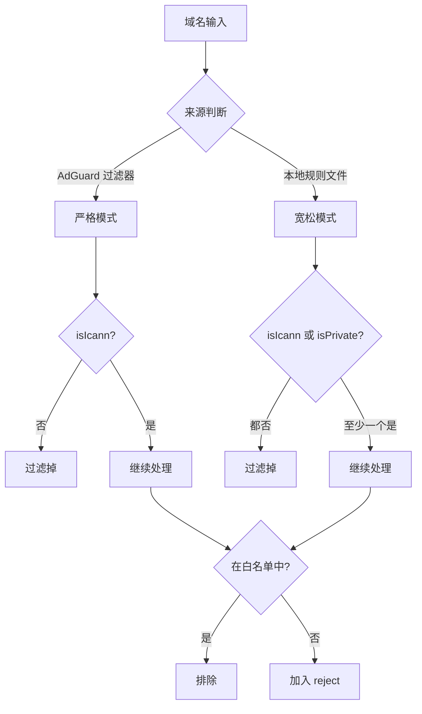

# Surge-master-2 TLD 验证逻辑分析总结

## 1. Surge-master-2 的 TLD 验证逻辑

### 1.1 核心验证机制

Surge-master-2 使用 `tldts` 库进行域名解析，但对不同来源的域名采用不同策略：

#### AdGuard 过滤器规则（严格模式）

```typescript
// parse-filter/filters.ts 第 566-579 行
if (!parsed.publicSuffix || !parsed.isIcann || !parsed.hostname || !parsed.domain) {
  result[1] = ParseType.Null; // 过滤掉
  return result;
}
```

- 只接受 ICANN 认证的 TLD
- 私有后缀（如 s3.amazonaws.com、github.io）会被过滤

#### 本地规则文件（宽松模式）

```typescript
// normalize-domain.ts
if (!parsed.isIcann && !parsed.isPrivate) return null;
```

- 接受 ICANN TLD 和私有后缀
- 只过滤非标准 TLD（如 .tor、.onion、.dn42）

### 1.2 预定义白名单机制

`PREDEFINED_WHITELIST` 包含 100+ 个域名，分为：

- **崩溃报告服务**（64 个）：Sentry、Bugsnag、Crashlytics 等
- **本地域名**：.localhost、.local 等
- **误报修正**：analytics.google.com、.t.co 等
- **CDN 反向 DNS**：.compute.amazonaws.com、.r2.dev 等

## 2. adtago.s3.amazonaws.com 案例分析

### 2.1 域名解析结果

```
域名: adtago.s3.amazonaws.com
publicSuffix: s3.amazonaws.com（私有后缀）
isIcann: false
isPrivate: true
```

### 2.2 处理结果

- **从 AdGuard 过滤器导入**：会被过滤（因为 isIcann = false）
- **在本地 reject.conf 中**：会被保留（因为 isPrivate = true）
- **实际情况**：该域名应该保留，因为它是追踪器

## 3. 判断逻辑梳理



## 4. 核心原则总结

1. **分级处理**：

   - 对外部源（AdGuard）严格
   - 对内部源（本地文件）宽松

2. **白名单优先**：

   - 崩溃报告服务豁免
   - 已知误报域名豁免

3. **基于用途判断**：
   - 不因托管在 CDN 就豁免追踪器
   - 精确匹配具体追踪器域名

## 5. 对 esdeath 项目的启示

1. **短期建议**：

   - 保留 adtago.s3.amazonaws.com（它是追踪器）
   - 不要过度信任 CDN 平台

2. **长期建议**：
   - 参考 Surge-master-2 的分级处理策略
   - 建立合理的私有后缀处理机制
   - 维护精确的白名单，避免误杀
